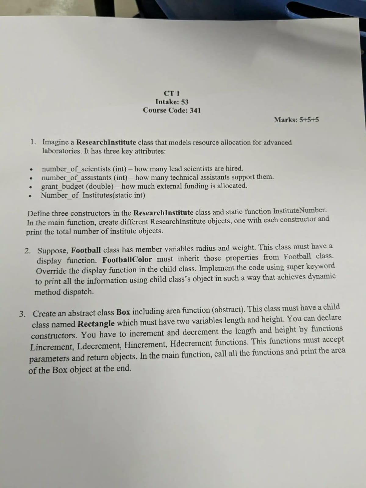

## CT-1 (53/8): Spring-2026



## Question 1

Imagine a `ResearchInstitute` class that models resource allocation for advanced laboratories. It has three key attributes:

- `number_of_scientists (int)` – how many lead scientists are hired.  
- `number_of_assistants (int)` – how many technical assistants support them.  
- `grant_budget (double)` – how much external funding is allocated.  
- `Number_of_Institutes (static int)`

Define three constructors in the `ResearchInstitute` class and a static function `InstituteNumber`.

In the `main` function:
- Create different `ResearchInstitute` objects (one using each constructor).
- Print the total number of institute objects created.

```java
class ResearchInstitute{
    int num_of_scientists;
    int num_of_assistants;
    double grant_budget;
    static int num_of_Institutes = 0;

    ResearchInstitute(){
        num_of_scientists = 1;
        num_of_assistants = 10;
        grant_budget = 1000;
        num_of_Institutes++;
    }
    ResearchInstitute(int num_of_scientists, int num_of_assistants){
        this.num_of_scientists = num_of_scientists;
        this.num_of_assistants = num_of_assistants;
        grant_budget = 40000;
        num_of_Institutes++;
    }

    ResearchInstitute(int num_of_scientists, int num_of_assistants,  double grant_budget){
        this.num_of_scientists = num_of_scientists;
        this.num_of_assistants = num_of_assistants;
        this.grant_budget = grant_budget;
        num_of_Institutes++;
    }

  public static void totalResearchInstitute(){
        System.out.println("Total ResearchInstitute objects "+num_of_Institutes);
    }
}
public class task {
    public static void main(String[] args) {
        ResearchInstitute r = new ResearchInstitute();
        ResearchInstitute r1 = new ResearchInstitute(10,10);
        ResearchInstitute r2 = new ResearchInstitute(7,9, 6.88);

        ResearchInstitute.totalResearchInstitute();
    }
}
```
## Question 2

Suppose, `Football` class has member variables `radius` and `weight`. This class must have a `display` function.

`FootballColor` must inherit those properties from the `Football` class.

- Override the `display` function in the child class.
- Implement the code using the `super` keyword.
- Print all the information using the child class’s object.
- Ensure the program achieves **dynamic method dispatch**.

```java
class Football{
    double radius, weight;
    Football(double radius, double weight){
        this.radius = radius;
        this.weight = weight;
    }
    void display(){
        System.out.println("The radius is: " + radius+ " The weight is: " + weight);
    }
}
class FootballColor extends Football{
    String color;
    FootballColor(double radius, double weight, String color){
        super(radius, weight);
        this.color = color;
    }
    void display(){
        System.out.println("The radius is: " + radius+ " The weight is: " + weight+ " The color is: " + color);
    }
}

public class task {
    public static void main(String[] args) {
        Football ob;
        FootballColor ob1 = new FootballColor(1,6,"red");
        ob = ob1;
        ob.display();
    }
}
```
## Question 3

Create an **abstract class Box** including **area function (abstract)**. This class must have a child class named **Rectangle** which must have two variables **length** and **height**. You can declare constructors. You have to increment and decrement the length and height by functions **Lincrement**, **Ldecrement**, **Hincrement**, **Hdecrement** functions. These functions must accept parameters and return objects. In the main function, call all the functions and print the area of the Box object at the end.

```java
abstract class Box {
    abstract double area();
}

class Rectangle extends Box {
    private double length, height;

    Rectangle(double length, double height) {
        this.length = length;
        this.height = height;
    }

    Rectangle Lincrement(double x) {
        length = length + x;
        return this;
    }

    Rectangle Ldecrement(double x) {
        length = length - x;
        return this;
    }

    Rectangle Hincrement(double x) {
        height = height + x;
        return this;
    }

    Rectangle Hdecrement(double x) {
        height = height - x;
        return this;
    }

    double area() {
        return length * height;
    }
}
public class task2 {
    public static void main(String[] args) {
        Rectangle r1 = new Rectangle(5, 10);

        r1.Lincrement(2);
        r1.Ldecrement(1);
        r1.Hincrement(3);
        r1.Hdecrement(2);

        Box b = r1;
        System.out.println("Area of rectangle: " + b.area());
    }
}
```